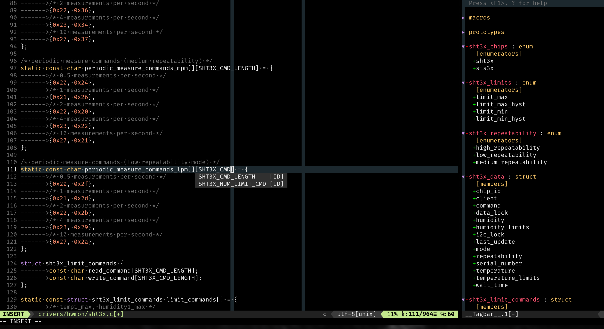

# vimrc
My personal configuration file for vim

## Installation
1. Set up the vim-plug plugin manager: https://github.com/junegunn/vim-plug
2. Copy .vimrc to ~/
3. run :PlugInstall
4. Enjoy

## Remarks
I use dwm as window manager and st as terminal. For the powerline fonts I use prepatched DejaVuSansMono.
